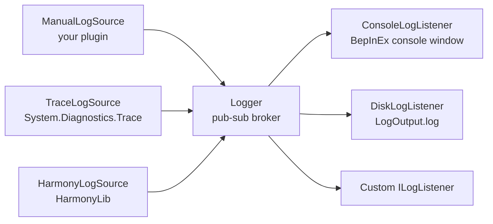

BepInEx provides a structured logging system built around a publish-subscribe model. Log sources emit events; log listeners consume them. The static `Logger` class acts as the broker between the two.

## Architecture



When a source raises its `LogEvent`, `Logger` fans the event out to every registered `ILogListener` whose `LogLevelFilter` matches the event's level. Sources and listeners are both thread-safe collections; you can add or remove them at any time.

## Log levels

`LogLevel` is a `[Flags]` enum, so levels can be combined with bitwise OR. Each value represents a severity band.

| Value | Integer | Description |
|-------|---------|-------------|
| `None` | `0` | No level. Used as a sentinel / filter that matches nothing. |
| `Fatal` | `1` | A fatal error has occurred that cannot be recovered from. |
| `Error` | `2` | An error has occurred, but execution can continue. |
| `Warning` | `4` | Something unexpected happened that may not be a problem. |
| `Message` | `8` | An important message intended to be shown to the user. |
| `Info` | `16` | A message of low importance, general status information. |
| `Debug` | `32` | Verbose output likely only useful to a developer. |
| `All` | `63` | Shorthand for `Fatal \| Error \| Warning \| Message \| Info \| Debug`. |

## Logging from a plugin

`BaseUnityPlugin` creates and registers a `ManualLogSource` for you, exposed as the `Logger` property. Use it directly in your plugin class:

```csharp MyPlugin.cs
[BepInPlugin("com.example.myplugin", "My Plugin", "1.0.0")]
public class MyPlugin : BaseUnityPlugin
{
    private void Awake()
    {
        Logger.LogInfo("Plugin loaded.");
        Logger.LogDebug("Awake() called on frame 0.");
    }
}
```

### Log method reference

Each method accepts either a plain `object` (converted via `ToString()`) or an interpolated string (see [zero-alloc logging](#zero-alloc-logging) below).

| Method | Level | Typical use |
|--------|-------|-------------|
| `LogFatal(data)` | `Fatal` | Unrecoverable errors — plugin cannot function. |
| `LogError(data)` | `Error` | Recoverable errors — something failed but the plugin continues. |
| `LogWarning(data)` | `Warning` | Unexpected state that may not cause problems. |
| `LogMessage(data)` | `Message` | Important user-facing status messages. |
| `LogInfo(data)` | `Info` | General status information, shown by default. |
| `LogDebug(data)` | `Debug` | Verbose detail, typically hidden in release builds. |

## Log output destinations

BepInEx registers two listeners on startup:

- **Console window** — outputs levels `Fatal`, `Error`, `Warning`, `Message`, and `Info` by default. Configurable via `Logging.Console` → `LogLevels` in `BepInEx.cfg`.
- **`BepInEx/LogOutput.log`** — writes all levels up to and including `Info` to disk. The file is recreated on each launch unless `appendLog` is set.

## `Logger.ListenedLogLevels`

`Logger.ListenedLogLevels` is the union of all registered listeners' `LogLevelFilter` values. BepInEx uses this to skip building log messages that no listener will ever consume.

```csharp
// Only emit the log event if at least one listener wants Debug messages
if ((Logger.ListenedLogLevels & LogLevel.Debug) != LogLevel.None)
{
    Logger.LogDebug("Expensive diagnostic: " + GatherDiagnostics());
}
```

In practice you rarely write this check by hand — the interpolated string handler does it for you automatically.

## Zero-alloc logging

Every log method has an overload that accepts a C# interpolated string handler (`$"..."`). The handler checks `Logger.ListenedLogLevels` **before** evaluating the interpolation, so no string is allocated when the level is not listened to.

```csharp
// String is only built if a listener actually wants Debug output.
// If no listener has Debug in its filter, this line costs no heap allocation.
Logger.LogDebug($"Processing item {item.Id} out of {total}");
```

<Note>
  This optimization is automatic when you use `$"..."` syntax. You do not need to write any guard code yourself. The C# compiler routes the call to the correct `BepInExLogInterpolatedStringHandler` overload based on the method signature.
</Note>

## Next steps

<CardGroup cols={2}>
  <Card title="Log sources" icon="tower-broadcast" href="/dev-guide/log-sources">
    Learn how to create and register custom log sources, and about the built-in bridge sources.
  </Card>
  <Card title="Log listeners" icon="ear-listen" href="/dev-guide/log-listeners">
    Implement a custom listener to route log output wherever you need it.
  </Card>
</CardGroup>
